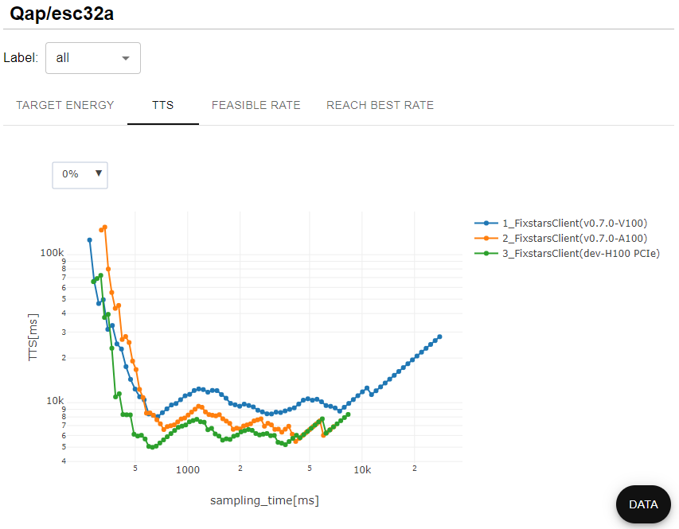
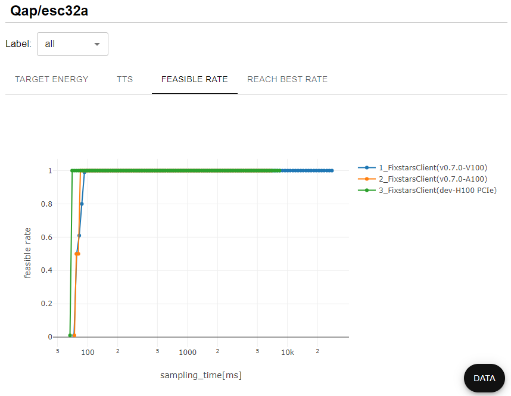
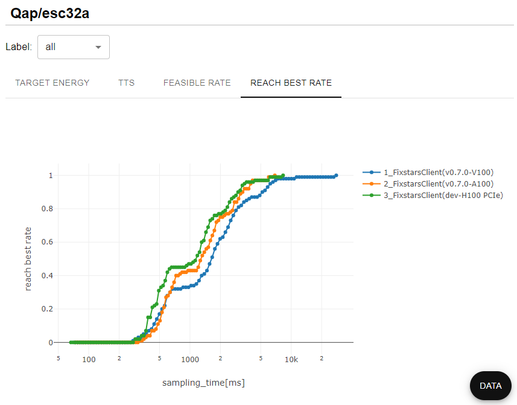
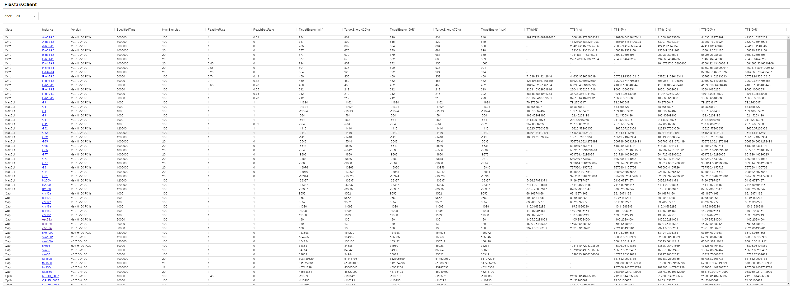
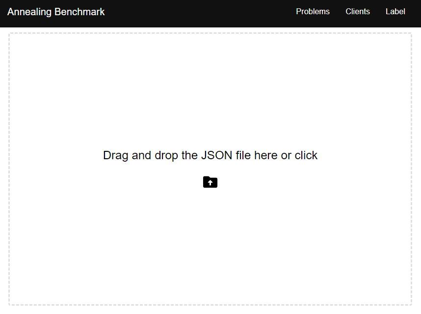
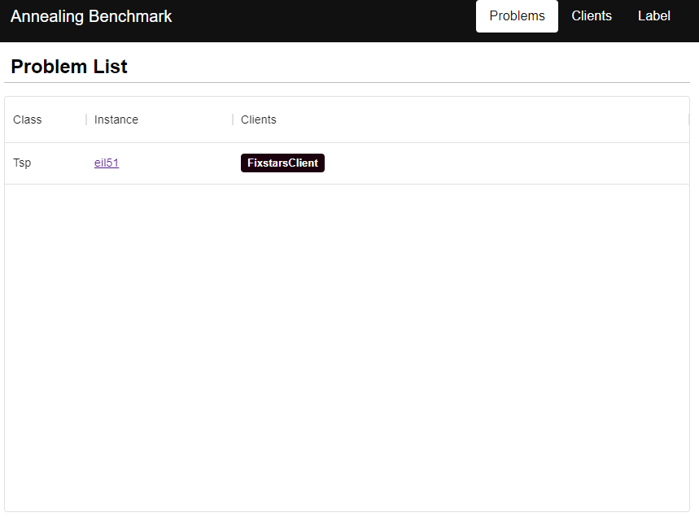
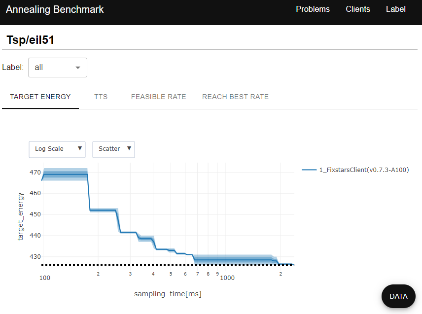

# Fixstars Amplify Benchmark

[![Fixstars](https://img.shields.io/badge/-Fixstars-333333.svg?logo=data:image/png;base64,iVBORw0KGgoAAAANSUhEUgAAAEAAAABACAYAAACqaXHeAAAAAXNSR0IArs4c6QAAAARnQU1BAACxjwv8YQUAAAAJcEhZcwAADsMAAA7DAcdvqGQAAAg4SURBVHhe7ZtpbFVFFMfnlsoSUVsKLpQIFgxENIpgWKoBao1LIHlIiMgHTOQDGg2CCaLSpwSqwQXBDY1BwKWPRRRQUISySh+obG5QFQouBRcoaFyx9Pr/35lbH+/dZe5b+sD0l5w350zLS+fcuWfOzBxEM81khyOFXfOUmlVyVNukYPAd0NSivUn2ZI+sOMBoZR5G8xNkJZxwh9WZJbLigHY1NSaaN6UlXoATHlZ6k5MVB0jMl5VCpsAJEaU3KYZqm5y6wi4tTNFiL9Qussdie0OD6N/h0L5/lJ1xsjYD2tUeOIFmmbQa6Z2TIw4cKSwqVHbGaVIH1K/Ka31iVf44yGTVZceBWDpiYn6BV+IqZWeUJnMABj3IEEYV1Kch+ewzhfkxmm+px3EOZAuccK00M0fGHYCB50NmQl0FudLqFOJdfrSvrfkbTfxrYNMCUgknjJJmZsiYAzDotpBJUGsg4yGt2A+qW9xwdJ3SyXuqdaMCTuD3ZISMOIDTHc1myHRIfMq7WLU2myAHperKdDhhSV1RUdpXrbQ6oH5VfmcMfgHU9ZDLrc5ETpryBbX7/kCzXFqeDDf/NrYcLixK6x4iLQ6ofy//HL7neDyfwBwpex2pMepN/k4876vWj74IpJuPdOzaU9kpk5IDGlbk5XC6G4bYAJPvOaO3F8tzhhxrUHosGyF/StWXnkjf1uCVuETZKZG0AzDwy8xcYyHU1ZArrE5/rOgfD16DY2i4SuhyAaQKTugnzeQJ7AAMPA8yFSqD1wjIGezXgLu/qFQdYewIAmPBRjhhrDSTQ9sB9e/ntcTAh0LdAQlDggajZVj+GPDcWAMJugdoCXkRTnhEmsHRcgAG3tswjSVQGa0vsjqDs1S1jqjXYKW0AvMgnMDXMTCeDsDACyDPQ10L4dNPdh2uM72nv01Sg1DcAicwmAbCdUAY+HVo5kAutDpSYyGm/61KdwXLWxv8Rb9DTSXh2Yp/XVrw/T5+jy8JMwAD7wVhqsrono7BE63DjoKD+7gUpjILSD/ssrYiYeqmbGfC0Vw2jQ7AoBnduWn5ADLY6kwPfLf5nbowGKbKpUiYduGVKFb2yYSjA/C5A+1Yw1yTbzScELej4wmItU1NM09i+k9Uui91nbrlmqaVLaYl0QEjEWAXWdqkbYZoeXwKtHGQXMyU7gafPAwGDy4p6eQ3SIVpmLNzrz92XHbpcaRjUb4wjMeg9odYUzUFquGAYXjaBdDnQ4ZYvUK8JaYNGJ723dUpSThais/XIOdbtmQQHLDx/+2AcFVbLCjl0DjlY8e6CYMfSMU1D5iwvrSPUk9PyqLdMWauPvdA4h80kzoLxxkwfl1pa+zwDkHdi0AxdGZJ5Q/yJ6cBk6tyRI7BY7RnIE5BvQ7SFTOAq5PzDJhVUvkXGp7Z94GLqjEbfJOYU4JwNA+Dfwkag53bijbDHjzxSoW52yPc40fgBH7pqUs4yhVjG2QMhAeqTvwiTPOkpMw1CGLAXC7ekVYj30BunDm4co80TwHKomdhFMxjuL777VBn4+nfpXQLrxnAQ814OkN2wzkPSTPLlEV7YPCcmbMgOttzLoUn4bkMYqD70cTe3cWyFNNp5MyStYGSnLQRjjJdfx3S0bL9+RBPP+EEyWsGEMcjLMUwZGufw0klym4ayqraYPBPQeOeQXfwhNv6BPwcsEu1blwMWQsnPCDNDFMW7QqnV0KbAHELdE58jbku9wNxeDvAtPYIOjwKJzjFjPQRjvbGIHiXyJ1cUF4RUwc4vqqeDjDlxeWP0vKlGE64U+mZgLdMyexWecbwqlQT8XSASoiqpaVFD9VmgmRT8wUIft8pPQG/GEC2q1YHvzu+VGAKmwyxpTgJ6DiAtz66xCdO6eQN1QZhC56+52GsjgN0j7N2IUPcrfRM8KJqg+C49MXi6wAMihuHA9LyJJNPX4jjLZmG6/wdNkjiTM+7CKIzA4hXQmTjVumRHh7rE1tbqMN8Ma3Y6ybKQtcBW1TrBqc/r8wyi2nOVZofnLXPStUbXQesUK0buvf7kopQGxEJdYbYZTOaNHyJD53XYB6C31Gle6LlABUHeLvrhp+D/iMSGoiMjtViHMhfsKeLhcP00trya5xqC+Nh/UHCrs8N3RlAYgubYvkMDvJPgyvwtCMhHlDygrWX1SeZJBrM7fiZbo3B26p1YwWe/k6l+xLEAW5f6n+TEwm1x1PnSQwLJJ2qSFhPtBO/d680PTBNrutOtYU2gZbLIA5we8reV9qRELfLX0FutmxvZuD3N2C28P8TOFNe7FVbeAAOCpK46TvANK2qzvj6nmpMf+dXIxLKg9gFkkE2MYwRNfi3vJ12w622cB4cpFtrZKHtgFkla1m9EZ8VOqenkRDrfFkqx8Ip3RKaWNpCVuN7HpdmPCYPbGul3ggDNY/CAxHkFSAfqdYmMfuLhO7GJ+OCblDzYiK+bxvkbGVLZIITn5zxrq/xuFuXoA7gsbPNQdMUnyqdA8+HsNCJCYhfuVwQekMO4rtvk2YjsUtvPcRz1+dGUAewaMJm0aySSgYkGxZOeRVJpsKZkPlwwhyxeIR9kMvXgDfQZKXfrs+NQA5QCdHP0oqbgqOWcQk7D8Ijq2GQ0ZD7Iaw74OktozMzOfuPToYxov6f/XBELzXd7Qx0nmoD43ks7sSE9aU8XByMVaELAqPvZsORSIi1CFzqWHHWHsK7e7bnQjpB6Ej+rxFKG0g83BiNFnvu4/3lc1ii+iL6/2r9JCDJOIA3RldjNvDpZp5IqDU+WRlKZzEY0lG0azHr5oqyaGtRPoBHd80000wzARHiX+svQrVLbT89AAAAAElFTkSuQmCC&style=popout-square)](https://www.fixstars.com/)
[![Fixstars Amplify](https://img.shields.io/badge/-Fixstars%20Amplify-333333.svg?logo=data:image/png;base64,iVBORw0KGgoAAAANSUhEUgAAAEAAAABACAYAAACqaXHeAAAAAXNSR0IArs4c6QAAAARnQU1BAACxjwv8YQUAAAAJcEhZcwAADsMAAA7DAcdvqGQAAAg4SURBVHhe7ZtpbFVFFMfnlsoSUVsKLpQIFgxENIpgWKoBao1LIHlIiMgHTOQDGg2CCaLSpwSqwQXBDY1BwKWPRRRQUISySh+obG5QFQouBRcoaFyx9Pr/35lbH+/dZe5b+sD0l5w350zLS+fcuWfOzBxEM81khyOFXfOUmlVyVNukYPAd0NSivUn2ZI+sOMBoZR5G8xNkJZxwh9WZJbLigHY1NSaaN6UlXoATHlZ6k5MVB0jMl5VCpsAJEaU3KYZqm5y6wi4tTNFiL9Qussdie0OD6N/h0L5/lJ1xsjYD2tUeOIFmmbQa6Z2TIw4cKSwqVHbGaVIH1K/Ka31iVf44yGTVZceBWDpiYn6BV+IqZWeUJnMABj3IEEYV1Kch+ewzhfkxmm+px3EOZAuccK00M0fGHYCB50NmQl0FudLqFOJdfrSvrfkbTfxrYNMCUgknjJJmZsiYAzDotpBJUGsg4yGt2A+qW9xwdJ3SyXuqdaMCTuD3ZISMOIDTHc1myHRIfMq7WLU2myAHperKdDhhSV1RUdpXrbQ6oH5VfmcMfgHU9ZDLrc5ETpryBbX7/kCzXFqeDDf/NrYcLixK6x4iLQ6ofy//HL7neDyfwBwpex2pMepN/k4876vWj74IpJuPdOzaU9kpk5IDGlbk5XC6G4bYAJPvOaO3F8tzhhxrUHosGyF/StWXnkjf1uCVuETZKZG0AzDwy8xcYyHU1ZArrE5/rOgfD16DY2i4SuhyAaQKTugnzeQJ7AAMPA8yFSqD1wjIGezXgLu/qFQdYewIAmPBRjhhrDSTQ9sB9e/ntcTAh0LdAQlDggajZVj+GPDcWAMJugdoCXkRTnhEmsHRcgAG3tswjSVQGa0vsjqDs1S1jqjXYKW0AvMgnMDXMTCeDsDACyDPQ10L4dNPdh2uM72nv01Sg1DcAicwmAbCdUAY+HVo5kAutDpSYyGm/61KdwXLWxv8Rb9DTSXh2Yp/XVrw/T5+jy8JMwAD7wVhqsrono7BE63DjoKD+7gUpjILSD/ssrYiYeqmbGfC0Vw2jQ7AoBnduWn5ADLY6kwPfLf5nbowGKbKpUiYduGVKFb2yYSjA/C5A+1Yw1yTbzScELej4wmItU1NM09i+k9Uui91nbrlmqaVLaYl0QEjEWAXWdqkbYZoeXwKtHGQXMyU7gafPAwGDy4p6eQ3SIVpmLNzrz92XHbpcaRjUb4wjMeg9odYUzUFquGAYXjaBdDnQ4ZYvUK8JaYNGJ723dUpSThais/XIOdbtmQQHLDx/+2AcFVbLCjl0DjlY8e6CYMfSMU1D5iwvrSPUk9PyqLdMWauPvdA4h80kzoLxxkwfl1pa+zwDkHdi0AxdGZJ5Q/yJ6cBk6tyRI7BY7RnIE5BvQ7SFTOAq5PzDJhVUvkXGp7Z94GLqjEbfJOYU4JwNA+Dfwkag53bijbDHjzxSoW52yPc40fgBH7pqUs4yhVjG2QMhAeqTvwiTPOkpMw1CGLAXC7ekVYj30BunDm4co80TwHKomdhFMxjuL777VBn4+nfpXQLrxnAQ814OkN2wzkPSTPLlEV7YPCcmbMgOttzLoUn4bkMYqD70cTe3cWyFNNp5MyStYGSnLQRjjJdfx3S0bL9+RBPP+EEyWsGEMcjLMUwZGufw0klym4ayqraYPBPQeOeQXfwhNv6BPwcsEu1blwMWQsnPCDNDFMW7QqnV0KbAHELdE58jbku9wNxeDvAtPYIOjwKJzjFjPQRjvbGIHiXyJ1cUF4RUwc4vqqeDjDlxeWP0vKlGE64U+mZgLdMyexWecbwqlQT8XSASoiqpaVFD9VmgmRT8wUIft8pPQG/GEC2q1YHvzu+VGAKmwyxpTgJ6DiAtz66xCdO6eQN1QZhC56+52GsjgN0j7N2IUPcrfRM8KJqg+C49MXi6wAMihuHA9LyJJNPX4jjLZmG6/wdNkjiTM+7CKIzA4hXQmTjVumRHh7rE1tbqMN8Ma3Y6ybKQtcBW1TrBqc/r8wyi2nOVZofnLXPStUbXQesUK0buvf7kopQGxEJdYbYZTOaNHyJD53XYB6C31Gle6LlABUHeLvrhp+D/iMSGoiMjtViHMhfsKeLhcP00trya5xqC+Nh/UHCrs8N3RlAYgubYvkMDvJPgyvwtCMhHlDygrWX1SeZJBrM7fiZbo3B26p1YwWe/k6l+xLEAW5f6n+TEwm1x1PnSQwLJJ2qSFhPtBO/d680PTBNrutOtYU2gZbLIA5we8reV9qRELfLX0FutmxvZuD3N2C28P8TOFNe7FVbeAAOCpK46TvANK2qzvj6nmpMf+dXIxLKg9gFkkE2MYwRNfi3vJ12w622cB4cpFtrZKHtgFkla1m9EZ8VOqenkRDrfFkqx8Ip3RKaWNpCVuN7HpdmPCYPbGul3ggDNY/CAxHkFSAfqdYmMfuLhO7GJ+OCblDzYiK+bxvkbGVLZIITn5zxrq/xuFuXoA7gsbPNQdMUnyqdA8+HsNCJCYhfuVwQekMO4rtvk2YjsUtvPcRz1+dGUAewaMJm0aySSgYkGxZOeRVJpsKZkPlwwhyxeIR9kMvXgDfQZKXfrs+NQA5QCdHP0oqbgqOWcQk7D8Ijq2GQ0ZD7Iaw74OktozMzOfuPToYxov6f/XBELzXd7Qx0nmoD43ks7sSE9aU8XByMVaELAqPvZsORSIi1CFzqWHHWHsK7e7bnQjpB6Ej+rxFKG0g83BiNFnvu4/3lc1ii+iL6/2r9JCDJOIA3RldjNvDpZp5IqDU+WRlKZzEY0lG0azHr5oqyaGtRPoBHd80000wzARHiX+svQrVLbT89AAAAAElFTkSuQmCC&style=popout-square)](https://amplify.fixstars.com/)
[](README.md)

## Amplify Benchmark とは？

Fixstars Amplify Benchmark は二次計画問題 (QUBO) の求解性能のベンチマークを行うフレームワークです。ベンチマークの実行を担うコマンドラインインターフェースとベンチマーク問題の定義を提供します。

バックエンドに [Fixstars Amplify SDK](https://amplify.fixstars.com/sdk) が用いられているため、量子アニーリングマシン、イジングマシン、数理最適化ソルバー等、数多くのソルバーを用いてベンチマークを実行することが可能です。ベンチマークは、対象の問題とその実行回数、使用するソルバーを指定したジョブが定義されるジョブセットファイルに基づいて実行されるため、実行から結果の取得までを自動で容易に行うことが出来ます。

このライブラリの実行結果を [Amplify Benchmark Viewer](https://github.com/fixstars/amplify-benchmark-viewer) で読み込むことで、結果を WEB ブラウザ上で可視化することが出来ます。Amplify AE を対象としたベンチマーク結果のデモは[こちら](https://amplify.fixstars.com/benchmark/)です。

### 特徴

* 実行が容易
* 並列実行
* 自動評価と解析
* ベンチマーク結果ビューアを提供
* カスタマイズ可能なソルバーと問題パラメータ
* 複数のベンチマークセットに対する定式化が定義済み
* ユーザ定義問題を追加可能

### 事前定義済みベンチマークセット

* 巡回セールスマン問題: [TSPLIB](http://comopt.ifi.uni-heidelberg.de/software/TSPLIB95/)
* 二次割当問題: [QAPLIB](https://coral.ise.lehigh.edu/data-sets/qaplib/)
* 最大カット問題: [Gset](https://web.stanford.edu/~yyye/yyye/Gset/)
* 容量制約付き配車ルート問題: [CVRPLIB](http://vrp.galgos.inf.puc-rio.br/index.php/en/)
* 二次計画問題: [QPLIB](https://qplib.zib.de/)
* 数独 (ペンシルパズル)

Amplify SDK により対応するソルバー:

* [Fixstars Amplify AE](https://amplify.fixstars.com/)
* [D-Wave Advantage](https://www.dwavesys.com/solutions-and-products/systems/)
* [Fujitsu Digital Annealer 3/4](https://www.fujitsu.com/global/services/business-services/digital-annealer/)
* [Toshiba SQBM+](https://www.global.toshiba/ww/products-solutions/ai-iot/sbm.html)
* [Gurobi Optimizer](https://www.gurobi.com/solutions/gurobi-optimizer/)
* ([その他 Amplify SDK が対応するクライアント](https://amplify.fixstars.com/docs/client.html))

## Gallery

|              Objective value for execution time              |                     Time To Solution (TTS)                      |
| :----------------------------------------------------------: | :-------------------------------------------------------------: |
|  |  |

|         Probability of obtaining a feasible solution         |        Probability of obtaining the best solution Rate         |
| :----------------------------------------------------------: | :------------------------------------------------------------: |
|  |  |

|                      Table DATA                       |
| :---------------------------------------------------: |
|  |

## 始め方

### インストール

Amplify benchmark は Python (>=3.8) ライブラリとして提供されています。次のようにして pip でインストール出来ます。

```bash
$ pip install amplify-bench
```

### サンプルセットの実行

インストール後、`amplify-bench` コマンドが有効になります。

```bash
$ amplify-bench --help
Usage: amplify-bench [OPTIONS] COMMAND [ARGS]...

Options:
  --help  Show this message and exit.

Commands:
  download  Download all supported instance files in the specified...
  run       QUBO Benchmark
  stats     Generate QUBO benchmark stats data.
```

ベンチマークを実行するためには、ベンチマーク定義 (以下、ジョブセット) ファイルを作成する必要があります。[`example/benchmark.yml`](example/benchmark.yml) ファイルはジョブセットファイルの例が記述されています。

[`example/benchmark.yml`](example/benchmark.yml)

```yaml
jobs:
  - problem:
      class: Tsp
      instance: eil51
    client:
      - FixstarsClient
      - token: INPUT_API_TOKEN
        parameters:
          timeout: 3000
    num_samples: 2
```

ベンチマークジョブセットファイルには YAML あるいは JSON ファイル形式でベンチマークジョブのリストを記述します。ジョブは実行回数、ベンチマーク対象の問題リスト、実行する [Client クラス](https://amplify.fixstars.com/docs/client.html) に与える設定値で構成されています。このジョブセットの場合、次のベンチマークジョブで構成されます。

* 対象の問題
  * `TSPLIB`: `eil51` instance
* 実行回数: 2
* 実行するクライアント: [`FixstarsClient`](https://amplify.fixstars.com/docs/client.html#fixstars)
  * `token`: INPUT_API_TOKEN
  * `parameter.timeout`: 3000

それでは、このジョブセットファイルを用いてベンチマークを実行してみましょう。`amplify-bench` コマンドの `run` サブコマンドにジョブセットファイルのパス与えて実行します。

> **Note**
> `INPUT_API_TOKEN` を自身の API トークンで置き換えてください。トークンを未入手の場合は、[Amplify WEBサイト](https://amplify.fixstars.com/) にアクセスし、[アカウントを作成](https://amplify.fixstars.com/ja/register)してください。


```bash
$ amplify-bench run benchmark.yml
input_json: benchmark.yml
label: 20230803_223440
output: None
parallel: 1
aws_profile: None
dry_run: False
cli_benchmark_impl() 20230803_223440
2023-08-03 22:34:41,308 [pid:94470] [INFO]:    542.49 ms in amplify_bench.cli.parser.parse_input_data
2023-08-03 22:34:41,309 [pid:94470] [INFO]: make model of eil51
2023-08-03 22:34:41,519 [pid:94470] [INFO]:    209.08 ms in amplify_bench.problem.tsp.make_tsp_model
total jobs:  2
success jobs:  2
error jobs:  0
Jobs not yet started:  0
```

実行が完了すると、デフォルトでは入力ファイルと同じディレクトリに実行結果として JSON ファイルが出力されます。ファイル名には実行時刻が付与されます。出力ファイルパスは `--output <path>` オプションで変更が可能です。

### Amplify Benchmark Viewer を用いた結果の可視化

実行結果は [Amplify Benchmark Viewer](https://github.com/fixstars/amplify-benchmark-viewer) で可視化することが出来ます。[Amplify Benchmark Viewer](https://github.com/fixstars/amplify-benchmark-viewer) で読み込むには `stas` サブコマンドに実行結果のファイル、あるいはディレクトリを与えて解析します。

```bash
$ amplify-bench stats preset_20230803_223440.json
```

デフォルトではカレントディレクトリに `report/data.json` ファイルが作成されます。出力ファイルのパス・ディレクトリは `--output` オプションで変更が可能です。

作成した `report/data.json` ファイルを Amplify Benchmark Viewer の [GitHub pages](https://fixstars.github.io/amplify-benchmark-viewer/) にドラッグ&ドロップすることで、結果を可視化出来ます。

> **Note**
> データはブラウザ上で展開され、サーバには保存されません。

| Drag and Drop `data.json` file                        | Show the evaluated problem list                             | The detailed evaluation for each problem               |
| ----------------------------------------------------- | ----------------------------------------------------------- | ------------------------------------------------------ |
|  |  |  |


## 高度な使い方

### ジョブセットファイルの書き方

#### `JobsetObject`

ジョブセットファイルには下記のキーを持つ JSON オブジェクトを記述します。ジョブセットファイルのスキーマは [`amplify_bench/cli/schemas`](amplify_bench/cli/schemas) に記述されています。

| key         | type               | description                             |
| ----------- | ------------------ | --------------------------------------- |
| `jobs`      | `array[JobObject]` | ベンチマークジョブのリスト              |
| `variables` | `object`           | ジョブで使用可能な変数の定義 (Optional) |

`variables` キーに与える変数定義は `jobs` 内で参照することが出来ます。この時、`$` から始まる文字列は変数名として扱われます。例えば次のように全ての問題に共通する設定を与えるときに有用です。

```yaml
variables:
  CLIENT:
    - FixstarsClient
    - parameters:
        timeout: 3000
jobs:
  - problem:
      class: Tsp
      instance: eil51
    client: $CLIENT
    num_samples: 2
  - problem:
      class: Tsp
      instance: burma14
    client: $CLIENT
    num_samples: 1
```

#### `JobObject`

| key           | type            | description                           |
| ------------- | --------------- | ------------------------------------- |
| `num_samples` | `int`           | 実行回数                              |
| `client`      | `array`         | クライアントの設定                    |
| `problem`     | `ProblemObject` | 問題設定                              |
| `matrix`      | `object[array]` | 変数の組合わせパターン定義 (Optional) |

`num_samples` に 1 より大きな整数値を入れると同じ設定で複数回実行します。`matrix` キーには後述する変数の組合わせパターンを設定します。

`client` キーには長さ2の配列を与えます。第一要素にクライアントクラス名を指定し、第二要素にはクライアントクラスのプロパティ値をオブジェクトで与えます。例えば、次の Amplify SDK におけるクライアント設定に対して、

```python
from amplify.client import FixstarsClient

client = FixstarsClient()
client.token = "INPUT_API_TOKEN"
client.parameters.timeout = 1000
```

以下のようにジョブセットファイルに記述します。

```yaml
jobs:
  - client:
      - FixstarsClient
      - token: INPUT_API_TOKEN
        parameters:
          timeout: 1000
```

> **Note**
> それぞれの `Client` クラスにおける設定可能なプロパティ値は [ドキュメント](https://amplify.fixstars.com/ja/docs/client.html) を参照してください。


#### `ProblemObject`

`problem` キーには以下のキーで構成されるオブジェクトを与えます。

| key          | type     | description      |
| ------------ | -------- | ---------------- |
| `class`      | `string` | 問題クラス名     |
| `instance`   | `string` | インスタンス名   |
| `parameters` | `object` | 定式化パラメータ |

`class` には [`amplify_bench/problem`](amplify_bench/problem) に含まれる問題クラス名を指定します。フレームワークにで事前に定義されている問題クラスは、`Tsp` (TSPLIB), `Qap` (QAPLIB), `Cvrp` (CVRPLIB), `MaxCut` (GSET), `Sudoku`, `Qplib` (QPLIB) です。`instance` にはそれぞれの問題クラスに対応する問題セットに含まれるインスタンス名を記述します。詳細は [`amplify_bench/problem/data`](amplify_bench/problem/data) を参照してください。問題クラスにはコンストラクタに与える定式化のパラメータを指定出来ることがあり、`parameter` で指定します。

#### マトリックス変数を用いた自動ジョブ生成

一つのジョブ定義に与えた複数の変数パターンの全ての組合わせに対して複数のジョブを自動的に生成することが出来ます。例えば、複数のインスタンスと複数の実行時間にする全ての組合わせに対して実行する場合、次のように記述します。

```yaml
variables:
  NUM_SAMPLES: 100
  FIXSTARS:
    - FixstarsClient
    - token: INPUT_API_TOKEN
      parameters:
        timeout: $TIMEOUT
jobs:
  - problem:
      class: Qap
      instance: $INSTANCE
    client: $FIXSTARS
    num_samples: $NUM_SAMPLES
    matrix:
      INSTANCE:
        - esc32a
        - sko56
      TIMEOUT:
        - 10000
        - 30000
```

`matrix` には変数名をキーにして、値を配列で与えます。この場合、`esc32a` と `sko56` それぞれに対して、`timeout` が `10000` と `30000` のジョブが生成されます。`variables` に定義されている変数の中で `matrix` に与えている変数を参照できることに注意してください。


> **Note**
> 変数の参照は再帰的に行われますが、無限ループが発生するとエラーになります。

### ユーザ定義問題の追加

ベンチマーク問題としてユーザが定義した定式化を追加することが出来ます。Amplify SDK を用いて定式化した問題クラスを `amplify_bench/problem` 以下に Python ファイルとして配置することで、Amplify Benchmark から認識されます。

まず、Amplify Benchmark に Python ファイルを追加するためにリポジトリをクローンします。

```bash
$ git clone https://github.com/fixstars/amplify-benchmark.git
```

最初に `amplify_bench/problem` 以下に、任意の Python ファイルを配置します。ファイル名は問題クラス名と同じで小文字にする必要があります。例えば、`Xyz` 問題を追加する場合、`amplify_bench/problem/xyz.py` というファイル名にします。

問題クラスは `Problem` クラスを継承し、コンストラクタ (`__init__`) と `make_model` と `evaluate` メソッドを実装する必要があります。`make_model` メソッドは定式化を、`evaluate` メソッドは解を入力として、定式化したモデルに対する評価を行います。

次のコードは Amplify Benchmark に内蔵されている[巡回セールスマン問題クラス](amplify_bench/problem/tsp.py)の実装の抜粋です。

```python
class Tsp(Problem):
    def __init__(
        self,
        instance: str,
        constraint_weight: float = 1.0,
        seed: int = 0,        path: Optional[str] = None,
    ):
        super().__init__()
        self._instance: str = instance
        self._problem_parameters["constraint_weight"] = constraint_weight
        if instance.startswith("random"):
            self._problem_parameters["seed"] = seed
        self._symbols = None

        ncity, distances, locations, best_known = self.__load(self._instance, seed, path)
        self._ncity = ncity
        self._distances = distances
        self._locations = locations  # not used
        self._best_known = best_known

    def make_model(self):
        print_log(f"make model of {self._instance}")
        symbols, model = make_tsp_model(self._ncity, self._distances, self._problem_parameters["constraint_weight"])
        self._symbols = symbols
        self._model = model

    def evaluate(self, solution: SolverSolution) -> Dict[str, Union[None, float, str]]:
        value: Optional[float] = None
        path: str = ""

        if solution.is_feasible:
            spins = solution.values
            variables = np.array(self._symbols.decode(spins))  # type: ignore
            index = np.where(variables == 1)[1]
            index_str = [str(idx) for idx in index]
            value = calc_tour_dist(list(index), self._distances)
            path = " ".join(index_str)
        else:
            pass

        return {"label": "total distances", "value": value, "path": path}
...
```

#### コンストラクタ

```python
def __init__(self, instance: str, **kwargs) -> None
```

コンストラクタの引数は少なくとも `instance: str` 引数を受け取る必要があります。それ以外で、例えばコンストラクタの引数に `constraint_weight: float` を追加した場合は、`ProblemObject` の `parameters` キーには `constraint_weight` が指定可能になります。

#### `make_model` メソッド

```python
def make_model(self) -> None
```

`make_model` メソッドは定式化を行い `self._model` に`amplify.BinaryQuadraticModel` クラスのインスタンスを格納する責務があります。

#### `evaluate` メソッド

```python
def evaluate(self, solution: amplify.SolverSolution) -> Dict[str, Union[None, float, str]]
```
`evaluate` メソッドは `amplify.SolverSolution` を受け取り解の評価を行います。返り値は `Dict[str, Union[None, float, str]]` として任意のキーと値を返すことが出来ます。返り値はベンチマーク結果の JSON ファイルにおいて `objective_value` キーに出力されます。

## プロジェクトへのコントリビューション

Amplify Benchmark はオープンソースプロジェクトです。バグの報告や機能の追加、ドキュメントの改善等、コントリビューションを歓迎します。

## 開発元

関連プロジェクト:

* [Fixstars Amplify SDK](https://amplify.fixstars.com/sdk)
* [Fixstars Amplify Annealing Engine](https://amplify.fixstars.com/engine)
* [Fixstars Amplify Benchmark Viewer](https://github.com/fixstars/amplify-benchmark-viewer)

<div align="left">
  <a href="https://www.fixstars.com/" target="_blank" rel="nofollow noreferrer">
    
  </a>
  <a href="https://amplify.fixstars.com/" target="_blank" rel="nofollow noreferrer">
    
  </a>
</div>
