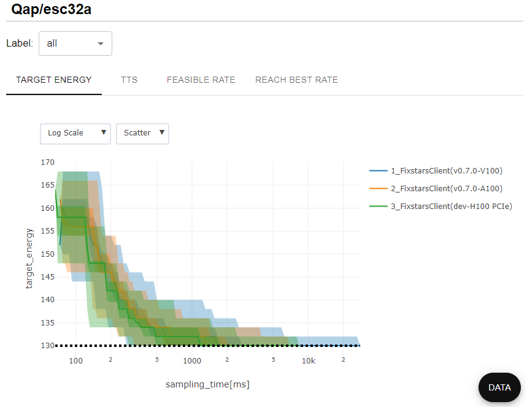
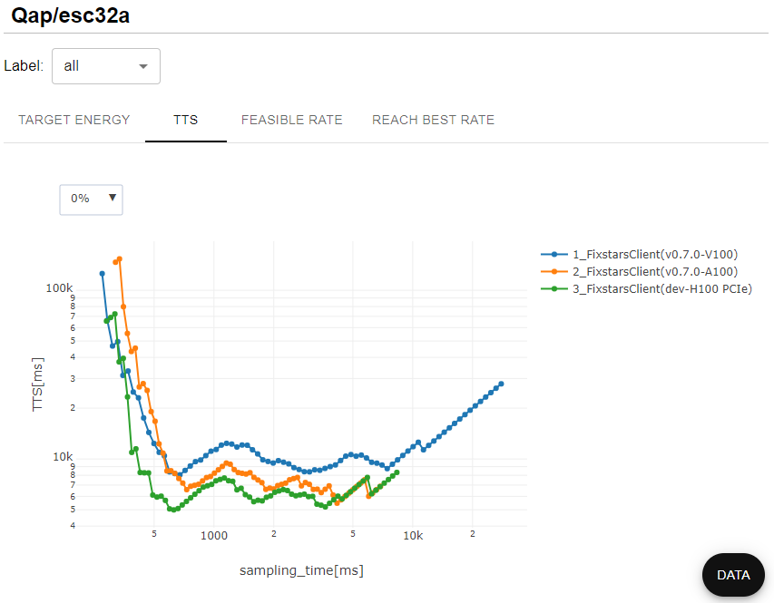
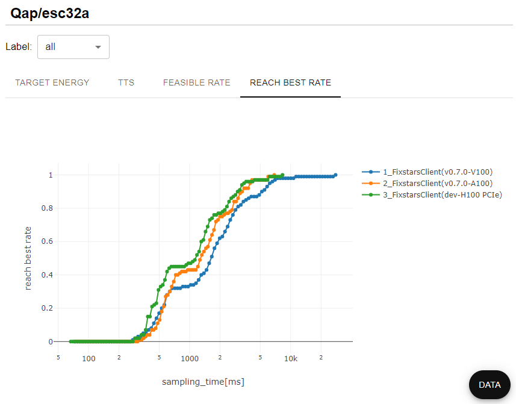
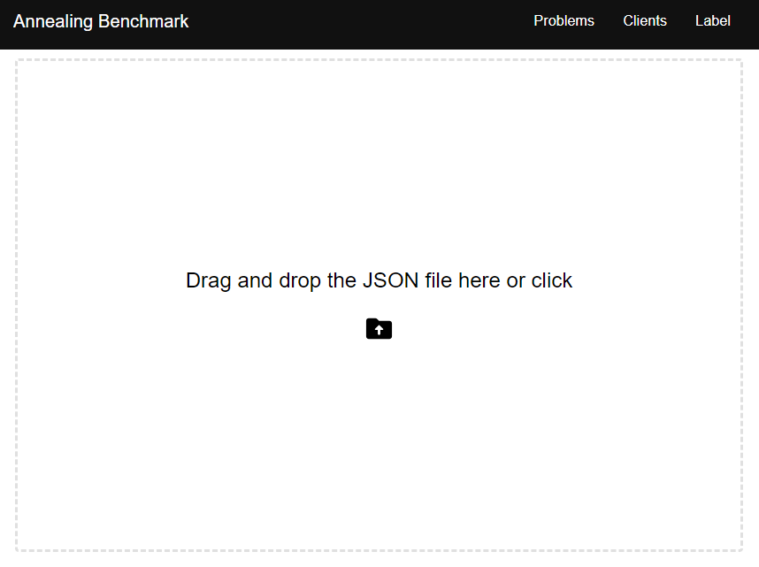
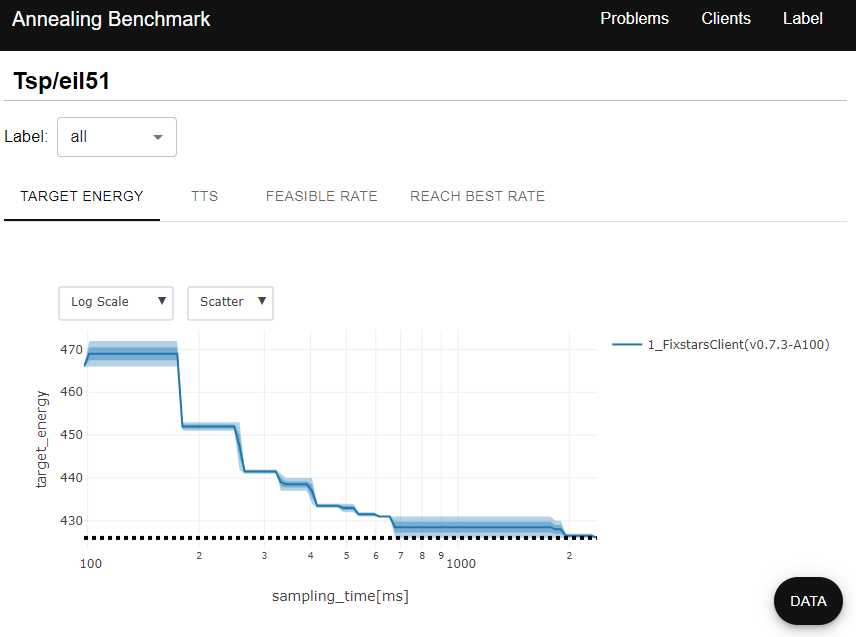

# Fixstars Amplify Benchmark

[![Fixstars](https://img.shields.io/badge/-Fixstars-333333.svg?logo=data:image/png;base64,iVBORw0KGgoAAAANSUhEUgAAAEAAAABACAYAAACqaXHeAAAAAXNSR0IArs4c6QAAAARnQU1BAACxjwv8YQUAAAAJcEhZcwAADsMAAA7DAcdvqGQAAAg4SURBVHhe7ZtpbFVFFMfnlsoSUVsKLpQIFgxENIpgWKoBao1LIHlIiMgHTOQDGg2CCaLSpwSqwQXBDY1BwKWPRRRQUISySh+obG5QFQouBRcoaFyx9Pr/35lbH+/dZe5b+sD0l5w350zLS+fcuWfOzBxEM81khyOFXfOUmlVyVNukYPAd0NSivUn2ZI+sOMBoZR5G8xNkJZxwh9WZJbLigHY1NSaaN6UlXoATHlZ6k5MVB0jMl5VCpsAJEaU3KYZqm5y6wi4tTNFiL9Qussdie0OD6N/h0L5/lJ1xsjYD2tUeOIFmmbQa6Z2TIw4cKSwqVHbGaVIH1K/Ka31iVf44yGTVZceBWDpiYn6BV+IqZWeUJnMABj3IEEYV1Kch+ewzhfkxmm+px3EOZAuccK00M0fGHYCB50NmQl0FudLqFOJdfrSvrfkbTfxrYNMCUgknjJJmZsiYAzDotpBJUGsg4yGt2A+qW9xwdJ3SyXuqdaMCTuD3ZISMOIDTHc1myHRIfMq7WLU2myAHperKdDhhSV1RUdpXrbQ6oH5VfmcMfgHU9ZDLrc5ETpryBbX7/kCzXFqeDDf/NrYcLixK6x4iLQ6ofy//HL7neDyfwBwpex2pMepN/k4876vWj74IpJuPdOzaU9kpk5IDGlbk5XC6G4bYAJPvOaO3F8tzhhxrUHosGyF/StWXnkjf1uCVuETZKZG0AzDwy8xcYyHU1ZArrE5/rOgfD16DY2i4SuhyAaQKTugnzeQJ7AAMPA8yFSqD1wjIGezXgLu/qFQdYewIAmPBRjhhrDSTQ9sB9e/ntcTAh0LdAQlDggajZVj+GPDcWAMJugdoCXkRTnhEmsHRcgAG3tswjSVQGa0vsjqDs1S1jqjXYKW0AvMgnMDXMTCeDsDACyDPQ10L4dNPdh2uM72nv01Sg1DcAicwmAbCdUAY+HVo5kAutDpSYyGm/61KdwXLWxv8Rb9DTSXh2Yp/XVrw/T5+jy8JMwAD7wVhqsrono7BE63DjoKD+7gUpjILSD/ssrYiYeqmbGfC0Vw2jQ7AoBnduWn5ADLY6kwPfLf5nbowGKbKpUiYduGVKFb2yYSjA/C5A+1Yw1yTbzScELej4wmItU1NM09i+k9Uui91nbrlmqaVLaYl0QEjEWAXWdqkbYZoeXwKtHGQXMyU7gafPAwGDy4p6eQ3SIVpmLNzrz92XHbpcaRjUb4wjMeg9odYUzUFquGAYXjaBdDnQ4ZYvUK8JaYNGJ723dUpSThais/XIOdbtmQQHLDx/+2AcFVbLCjl0DjlY8e6CYMfSMU1D5iwvrSPUk9PyqLdMWauPvdA4h80kzoLxxkwfl1pa+zwDkHdi0AxdGZJ5Q/yJ6cBk6tyRI7BY7RnIE5BvQ7SFTOAq5PzDJhVUvkXGp7Z94GLqjEbfJOYU4JwNA+Dfwkag53bijbDHjzxSoW52yPc40fgBH7pqUs4yhVjG2QMhAeqTvwiTPOkpMw1CGLAXC7ekVYj30BunDm4co80TwHKomdhFMxjuL777VBn4+nfpXQLrxnAQ814OkN2wzkPSTPLlEV7YPCcmbMgOttzLoUn4bkMYqD70cTe3cWyFNNp5MyStYGSnLQRjjJdfx3S0bL9+RBPP+EEyWsGEMcjLMUwZGufw0klym4ayqraYPBPQeOeQXfwhNv6BPwcsEu1blwMWQsnPCDNDFMW7QqnV0KbAHELdE58jbku9wNxeDvAtPYIOjwKJzjFjPQRjvbGIHiXyJ1cUF4RUwc4vqqeDjDlxeWP0vKlGE64U+mZgLdMyexWecbwqlQT8XSASoiqpaVFD9VmgmRT8wUIft8pPQG/GEC2q1YHvzu+VGAKmwyxpTgJ6DiAtz66xCdO6eQN1QZhC56+52GsjgN0j7N2IUPcrfRM8KJqg+C49MXi6wAMihuHA9LyJJNPX4jjLZmG6/wdNkjiTM+7CKIzA4hXQmTjVumRHh7rE1tbqMN8Ma3Y6ybKQtcBW1TrBqc/r8wyi2nOVZofnLXPStUbXQesUK0buvf7kopQGxEJdYbYZTOaNHyJD53XYB6C31Gle6LlABUHeLvrhp+D/iMSGoiMjtViHMhfsKeLhcP00trya5xqC+Nh/UHCrs8N3RlAYgubYvkMDvJPgyvwtCMhHlDygrWX1SeZJBrM7fiZbo3B26p1YwWe/k6l+xLEAW5f6n+TEwm1x1PnSQwLJJ2qSFhPtBO/d680PTBNrutOtYU2gZbLIA5we8reV9qRELfLX0FutmxvZuD3N2C28P8TOFNe7FVbeAAOCpK46TvANK2qzvj6nmpMf+dXIxLKg9gFkkE2MYwRNfi3vJ12w622cB4cpFtrZKHtgFkla1m9EZ8VOqenkRDrfFkqx8Ip3RKaWNpCVuN7HpdmPCYPbGul3ggDNY/CAxHkFSAfqdYmMfuLhO7GJ+OCblDzYiK+bxvkbGVLZIITn5zxrq/xuFuXoA7gsbPNQdMUnyqdA8+HsNCJCYhfuVwQekMO4rtvk2YjsUtvPcRz1+dGUAewaMJm0aySSgYkGxZOeRVJpsKZkPlwwhyxeIR9kMvXgDfQZKXfrs+NQA5QCdHP0oqbgqOWcQk7D8Ijq2GQ0ZD7Iaw74OktozMzOfuPToYxov6f/XBELzXd7Qx0nmoD43ks7sSE9aU8XByMVaELAqPvZsORSIi1CFzqWHHWHsK7e7bnQjpB6Ej+rxFKG0g83BiNFnvu4/3lc1ii+iL6/2r9JCDJOIA3RldjNvDpZp5IqDU+WRlKZzEY0lG0azHr5oqyaGtRPoBHd80000wzARHiX+svQrVLbT89AAAAAElFTkSuQmCC&style=popout-square)](https://www.fixstars.com/)
[![Fixstars Amplify](https://img.shields.io/badge/-Fixstars%20Amplify-333333.svg?logo=data:image/png;base64,iVBORw0KGgoAAAANSUhEUgAAAEAAAABACAYAAACqaXHeAAAAAXNSR0IArs4c6QAAAARnQU1BAACxjwv8YQUAAAAJcEhZcwAADsMAAA7DAcdvqGQAAAg4SURBVHhe7ZtpbFVFFMfnlsoSUVsKLpQIFgxENIpgWKoBao1LIHlIiMgHTOQDGg2CCaLSpwSqwQXBDY1BwKWPRRRQUISySh+obG5QFQouBRcoaFyx9Pr/35lbH+/dZe5b+sD0l5w350zLS+fcuWfOzBxEM81khyOFXfOUmlVyVNukYPAd0NSivUn2ZI+sOMBoZR5G8xNkJZxwh9WZJbLigHY1NSaaN6UlXoATHlZ6k5MVB0jMl5VCpsAJEaU3KYZqm5y6wi4tTNFiL9Qussdie0OD6N/h0L5/lJ1xsjYD2tUeOIFmmbQa6Z2TIw4cKSwqVHbGaVIH1K/Ka31iVf44yGTVZceBWDpiYn6BV+IqZWeUJnMABj3IEEYV1Kch+ewzhfkxmm+px3EOZAuccK00M0fGHYCB50NmQl0FudLqFOJdfrSvrfkbTfxrYNMCUgknjJJmZsiYAzDotpBJUGsg4yGt2A+qW9xwdJ3SyXuqdaMCTuD3ZISMOIDTHc1myHRIfMq7WLU2myAHperKdDhhSV1RUdpXrbQ6oH5VfmcMfgHU9ZDLrc5ETpryBbX7/kCzXFqeDDf/NrYcLixK6x4iLQ6ofy//HL7neDyfwBwpex2pMepN/k4876vWj74IpJuPdOzaU9kpk5IDGlbk5XC6G4bYAJPvOaO3F8tzhhxrUHosGyF/StWXnkjf1uCVuETZKZG0AzDwy8xcYyHU1ZArrE5/rOgfD16DY2i4SuhyAaQKTugnzeQJ7AAMPA8yFSqD1wjIGezXgLu/qFQdYewIAmPBRjhhrDSTQ9sB9e/ntcTAh0LdAQlDggajZVj+GPDcWAMJugdoCXkRTnhEmsHRcgAG3tswjSVQGa0vsjqDs1S1jqjXYKW0AvMgnMDXMTCeDsDACyDPQ10L4dNPdh2uM72nv01Sg1DcAicwmAbCdUAY+HVo5kAutDpSYyGm/61KdwXLWxv8Rb9DTSXh2Yp/XVrw/T5+jy8JMwAD7wVhqsrono7BE63DjoKD+7gUpjILSD/ssrYiYeqmbGfC0Vw2jQ7AoBnduWn5ADLY6kwPfLf5nbowGKbKpUiYduGVKFb2yYSjA/C5A+1Yw1yTbzScELej4wmItU1NM09i+k9Uui91nbrlmqaVLaYl0QEjEWAXWdqkbYZoeXwKtHGQXMyU7gafPAwGDy4p6eQ3SIVpmLNzrz92XHbpcaRjUb4wjMeg9odYUzUFquGAYXjaBdDnQ4ZYvUK8JaYNGJ723dUpSThais/XIOdbtmQQHLDx/+2AcFVbLCjl0DjlY8e6CYMfSMU1D5iwvrSPUk9PyqLdMWauPvdA4h80kzoLxxkwfl1pa+zwDkHdi0AxdGZJ5Q/yJ6cBk6tyRI7BY7RnIE5BvQ7SFTOAq5PzDJhVUvkXGp7Z94GLqjEbfJOYU4JwNA+Dfwkag53bijbDHjzxSoW52yPc40fgBH7pqUs4yhVjG2QMhAeqTvwiTPOkpMw1CGLAXC7ekVYj30BunDm4co80TwHKomdhFMxjuL777VBn4+nfpXQLrxnAQ814OkN2wzkPSTPLlEV7YPCcmbMgOttzLoUn4bkMYqD70cTe3cWyFNNp5MyStYGSnLQRjjJdfx3S0bL9+RBPP+EEyWsGEMcjLMUwZGufw0klym4ayqraYPBPQeOeQXfwhNv6BPwcsEu1blwMWQsnPCDNDFMW7QqnV0KbAHELdE58jbku9wNxeDvAtPYIOjwKJzjFjPQRjvbGIHiXyJ1cUF4RUwc4vqqeDjDlxeWP0vKlGE64U+mZgLdMyexWecbwqlQT8XSASoiqpaVFD9VmgmRT8wUIft8pPQG/GEC2q1YHvzu+VGAKmwyxpTgJ6DiAtz66xCdO6eQN1QZhC56+52GsjgN0j7N2IUPcrfRM8KJqg+C49MXi6wAMihuHA9LyJJNPX4jjLZmG6/wdNkjiTM+7CKIzA4hXQmTjVumRHh7rE1tbqMN8Ma3Y6ybKQtcBW1TrBqc/r8wyi2nOVZofnLXPStUbXQesUK0buvf7kopQGxEJdYbYZTOaNHyJD53XYB6C31Gle6LlABUHeLvrhp+D/iMSGoiMjtViHMhfsKeLhcP00trya5xqC+Nh/UHCrs8N3RlAYgubYvkMDvJPgyvwtCMhHlDygrWX1SeZJBrM7fiZbo3B26p1YwWe/k6l+xLEAW5f6n+TEwm1x1PnSQwLJJ2qSFhPtBO/d680PTBNrutOtYU2gZbLIA5we8reV9qRELfLX0FutmxvZuD3N2C28P8TOFNe7FVbeAAOCpK46TvANK2qzvj6nmpMf+dXIxLKg9gFkkE2MYwRNfi3vJ12w622cB4cpFtrZKHtgFkla1m9EZ8VOqenkRDrfFkqx8Ip3RKaWNpCVuN7HpdmPCYPbGul3ggDNY/CAxHkFSAfqdYmMfuLhO7GJ+OCblDzYiK+bxvkbGVLZIITn5zxrq/xuFuXoA7gsbPNQdMUnyqdA8+HsNCJCYhfuVwQekMO4rtvk2YjsUtvPcRz1+dGUAewaMJm0aySSgYkGxZOeRVJpsKZkPlwwhyxeIR9kMvXgDfQZKXfrs+NQA5QCdHP0oqbgqOWcQk7D8Ijq2GQ0ZD7Iaw74OktozMzOfuPToYxov6f/XBELzXd7Qx0nmoD43ks7sSE9aU8XByMVaELAqPvZsORSIi1CFzqWHHWHsK7e7bnQjpB6Ej+rxFKG0g83BiNFnvu4/3lc1ii+iL6/2r9JCDJOIA3RldjNvDpZp5IqDU+WRlKZzEY0lG0azHr5oqyaGtRPoBHd80000wzARHiX+svQrVLbT89AAAAAElFTkSuQmCC&style=popout-square)](https://amplify.fixstars.com/)
[](README-ja.md)

## What is Amplify Benchmark?

Fixstars Amplify Benchmark is a framework for benchmarking the performances of solvers for quadratic unconstrained binary optimization problems (QUBO). It provides a command line interface to perform benchmarking and a definition of the benchmark problem.

The [Fixstars Amplify SDK](https://amplify.fixstars.com/sdk) is used as the backend, allowing benchmarks to be run with many solvers such as quantum annealing machines, Ising machines, and mathematical optimization solvers. Benchmarks are run based on a job set file that defines the target problems, the number of runs, and the solvers to be used, making it easy to automate the process from benchmark execution to analyzing results.

The results of this library run can be loaded into the [Amplify Benchmark Viewer](https://github.com/fixstars/amplify-benchmark-viewer) to visualize the results in a web browser. A demo of the benchmark results for Amplify AE is [here](https://amplify.fixstars.com/benchmark/).

### Features

* Easy to run
* Parallel execution
* Automatic evaluation and analysis
* Benchmark result viewer is provided
* Customizable solver and problem parameters
* Formulations for several benchmark sets are pre-defined
* User-define problems can be added

Pre-defined benchmark sets:

* Traveling Salesperson Problem: [TSPLIB](http://comopt.ifi.uni-heidelberg.de/software/TSPLIB95/)
* Quadratic Assignment Problem: [QAPLIB](https://coral.ise.lehigh.edu/data-sets/qaplib/)
* Max-CUT Problem: [Gset](https://web.stanford.edu/~yyye/yyye/Gset/)
* Capacitated Vehicle Routing Problem: [CVRPLIB](http://vrp.galgos.inf.puc-rio.br/index.php/en/)
* Quadratic Problem: [QPLIB](https://qplib.zib.de/)
* Sudoku (logic-based combinatorial number-placement puzzle)

Supported solvers powered by Amplify SDK:

* [Fixstars Amplify AE](https://amplify.fixstars.com/)
* [D-Wave Advantage](https://www.dwavesys.com/solutions-and-products/systems/)
* [Fujitsu Digital Annealer 3/4](https://www.fujitsu.com/global/services/business-services/digital-annealer/)
* [Toshiba SQBM+](https://www.global.toshiba/ww/products-solutions/ai-iot/sbm.html)
* [Gurobi Optimizer](https://www.gurobi.com/solutions/gurobi-optimizer/)
* (See [supported solvers of Amplify SDK](https://amplify.fixstars.com/docs/client.html))

## Gallery

|              Objective value for execution time              | Time To Solution (TTS)                                          |
| :----------------------------------------------------------: | --------------------------------------------------------------- |
|  |  |

| Probability of obtaining a feasible solution                 | Probability of obtaining the best solution Rate                |
| ------------------------------------------------------------ | -------------------------------------------------------------- |
|  |  |

| Table DATA                                            |
| ----------------------------------------------------- |
|  |

## Getting started

### Installation

Amplify benchmark is provided as a Python (>=3.8) library. It can be installed with pip as follows:

```bash
$ pip install amplify-bench
```

### Run example job set

After installation, the `amplify-bench` command is enabled.

```bash
$ amplify-bench --help
Usage: amplify-bench [OPTIONS] COMMAND [ARGS]...

Options:
  --help  Show this message and exit.

Commands:
  download  Download all supported instance files in the specified...
  run       QUBO Benchmark
  stats     Generate QUBO benchmark stats data.
```

To run a benchmark, you have to create a benchmark definition ("job set") file. The [`example/benchmark.yml`](example/benchmark.yml) file contains a sample job set file.

[`example/benchmark.yml`](example/benchmark.yml)

```yaml
jobs:
  - problem:
      class: Tsp
      instance: eil51
    client:
      - FixstarsClient
      - token: INPUT_API_TOKEN
        parameters:
          timeout: 3000
    num_samples: 2
```

The benchmark job set file contains a list of benchmark jobs in YAML or JSON file format. The jobs consist of the number of runs, a list of problems to solve, and parameter values passed to the [Client class](https://amplify.fixstars.com/docs/client.html) to run. For this job set, it consists of the following benchmark jobs:

* target problem:
    * `TSPLIB`: `eil51` instance
* number of runs: 2
* [`FixstarsClient`](https://amplify.fixstars.com/docs/client.html#fixstars)
    * `token`: INPUT_API_TOKEN
    * `parameter.timeout`: 3000

Now to start the benchmark using this job set file, run the `amplify-bench` command with the `run` subcommand with the path to the job set file.

> **Note**
> Replace `INPUT_API_TOKEN` with your API token. If you do not have an API token, go to [Amplify WEB site](https://amplify.fixstars.com/) and [create an account](https://amplify.fixstars.com/ja/register).

```bash
$ amplify-bench run benchmark.yml
input_json: benchmark.yml
label: 20230803_223440
output: None
parallel: 1
aws_profile: None
dry_run: False
cli_benchmark_impl() 20230803_223440
2023-08-03 22:34:41,308 [pid:94470] [INFO]:    542.49 ms in amplify_bench.cli.parser.parse_input_data
2023-08-03 22:34:41,309 [pid:94470] [INFO]: make model of eil51
2023-08-03 22:34:41,519 [pid:94470] [INFO]:    209.08 ms in amplify_bench.problem.tsp.make_tsp_model
total jobs:  2
success jobs:  2
error jobs:  0
Jobs not yet started:  0
```

When execution completes a JSON file is output as the result of the execution in the same directory. The file name is appended with the execution time by default. The output file path can be changed with the `--output <path>` option.

### Open the result with Amplify Benchmark Viewer

The results can be visualized using the [Amplify Benchmark Viewer](https://github.com/fixstars/amplify-benchmark-viewer). To analyze for the viewer, give the `stats` subcommand with the path to a directory or a result file to the `amplify-bench` command.

```bash
$ amplify-bench stats preset_20230803_223440.json
```

By default, a `report/data.json` file is created in the current directory. The path directory of the output file can be changed with the `--output` option.

Then, drag and drop the created `report/data.json` file into the Amplify Benchmark Viewer [GitHub pages](https://fixstars.github.io/amplify-benchmark-viewer/) to visualize the results.

> **Note**
> The data is analyzed only on the browser and is not stored on the external server.

| Drag and Drop `data.json` file                        | Show the evaluated problem list                             | The detailed evaluation for each problem               |
| ----------------------------------------------------- | ----------------------------------------------------------- | ------------------------------------------------------ |
|  |  |  |

## Advanced usage

### job set file in details

#### `PresetObject`

A job set file consisted of JSON objects with the following keys. The schema of the job set file is described in [`amplify_bench/cli/schemas`](amplify_bench/cli/schemas).

| key         | type               | description                                        |
| ----------- | ------------------ | -------------------------------------------------- |
| `jobs`      | `array[JobObject]` | list of benchmark jobs                             |
| `variables` | `object`           | definitions of variables used in `jobs` (Optional) |
| `imports`   | `array[string]`    | User-defined problem file path (Optional)          |

Variable definitions for the `variables` key can be referenced in `jobs`. A string starting with `$` is treated as a variable name. This is useful, for example, to specify a setting that is commonly used in multiple jobs

```yaml
variables:
  CLIENT:
    - FixstarsClient
    - parameters:
        timeout: 3000
jobs:
  - problem:
      class: Tsp
      instance: eil51
    client: $CLIENT
    num_samples: 2
  - problem:
      class: Tsp
      instance: burma14
    client: $CLIENT
    num_samples: 1
```

`imports` specifies the list of paths to the user-defined problem file. Enter the path as a relative path from a job set file, a relative path from the current directory, or an absolute path. For details on user-defined question files, see [Create your own benchmark problems](#create-your-own-benchmark-problems).

#### `JobObject`

| key           | type            | description                                     |
| ------------- | --------------- | ----------------------------------------------- |
| `num_samples` | `int`           | the number of runs                              |
| `client`      | `array`         | client name and parameters                      |
| `problem`     | `ProblemObject` | the problem definition                          |
| `matrix`      | `object[array]` | the definitions of variable patterns (Optional) |

If `num_samples` is an integer greater than 1, it will be run multiple times with the same settings. The `matrix` key is given with the patterns of variables explained later.

The `client` key is given an array of length 2. The first element of the array is the name of the client class, and the second element is an object with the property values of the client. For example, the following client configuration in the Amplify SDK

```python
from amplify.client import FixstarsClient

client = FixstarsClient()
client.token = "INPUT_API_TOKEN"
client.parameters.timeout = 1000
```

should be specified as follows in the job set file.

```yaml
jobs:
  - client:
      - FixstarsClient
      - token: INPUT_API_TOKEN
        parameters:
          timeout: 1000
```

> **Note**
> See the [documentation](https://amplify.fixstars.com/ja/docs/client.html) for the available properties for each `Client` class.

#### `ProblemObject`

The `problem` key has an object consisting of the following keys:

| key          | type     | description                                 |
| ------------ | -------- | ------------------------------------------- |
| `class`      | `string` | The name of the problem class               |
| `instance`   | `string` | Instance name                               |
| `parameters` | `object` | Constructor parameters of the problem class |

The `class` is the name of the problem class contained in [`amplify_bench/problem`](https://github.com/fixstars/amplify-benchmark/tree/main/amplify_bench/problem). The predefined problem classes are `Tsp` (TSPLIB), `Qap` (QAPLIB), `Cvrp` (CVRPLIB), `MaxCut` (GSET), `Sudoku` and `Qplib` (QPLIB). The `instance` is the name of the instance in the problem set corresponding to each problem class. See [`amplify_bench/problem/data`](amplify_bench/problem/data) for details. Problem classes may have formulation parameters that can be passed to the constructor, which can be specified by `parameter` key.

#### Using a matrix for your jobs

Multiple jobs can be automatically generated for all combinations of multiple variable patterns given in a single job definition. For example, to run for all combinations of multiple instances and multiple runtimes, the following job set file can be used.

```yaml
variables:
  NUM_SAMPLES: 100
  FIXSTARS:
    - FixstarsClient
    - token: INPUT_API_TOKEN
      parameters:
        timeout: $TIMEOUT
jobs:
  - problem:
      class: Qap
      instance: $INSTANCE
    client: $FIXSTARS
    num_samples: $NUM_SAMPLES
    matrix:
      INSTANCE:
        - esc32a
        - sko56
      TIMEOUT:
        - 10000
        - 30000
```

The `matrix` is an array of values with the variable names as keys. In this case, jobs with `timeout` of `10000` and `30000` will be created for `esc32a` and `sko56` respectively. Note that you can refer to the variables you pass to `matrix` in the variables defined in `variables`.

> **Note**
> Variables are referenced recursively, but an infinite loop will fail.

### Create your own benchmark problems

User-defined formulations can be added as benchmark problems that are recognized in Amplify Benchmark.

The following example runs a benchmark against the `MyTsp` class defined in the `mytsp.py` file. Setting a list of Python file paths to the `imports` key will load additional probem classes defined in the files. A file path must be specified as an absolute path or relative to the job set file or the current directory.

```yaml
imports:
  - mytsp.py
jobs:
  - problem:
      class: MyTsp
      instance: random8
```

> **Note**
> User-defined class names should not duplicate the built-in problem classes.

The problem class must extend the `Problem` class and implement the constructor (`__init__`) and the methods `make_model` and `evaluate`. The `make_model` method formulates the problem in Amplify SDK and the `evaluate` method evaluates the formulated model with the solution as input.

The following code snippet is an example of a `MyTsp` problem class.

`mytsp.py`

```python
class MyTsp(Problem):
    def __init__(
        self,
        instance: str,
        constraint_weight: float = 1.0,
        seed: int = 0,
        path: Optional[str] = None,
    ):
        super().__init__()
        self._instance: str = instance
        self._problem_parameters["constraint_weight"] = constraint_weight
        if instance.startswith("random"):
            self._problem_parameters["seed"] = seed
        self._symbols = None

        ncity, distances, locations, best_known = self.__load(self._instance, seed, path)
        self._ncity = ncity
        self._distances = distances
        self._locations = locations  # not used
        self._best_known = best_known

    def make_model(self):
        symbols, model = make_tsp_model(self._ncity, self._distances, self._problem_parameters["constraint_weight"])
        self._symbols = symbols
        self._model = model

    def evaluate(self, solution: SolverSolution) -> Dict[str, Union[None, float, str]]:
        value: Optional[float] = None
        path: str = ""

        if solution.is_feasible:
            spins = solution.values
            variables = np.array(self._symbols.decode(spins))  # type: ignore
            index = np.where(variables == 1)[1]
            index_str = [str(idx) for idx in index]
            value = calc_tour_dist(list(index), self._distances)
            path = " ".join(index_str)
        else:
            pass

        return {"label": "total distances", "value": value, "path": path}
...
```

#### Constructor

```python
def __init__(self, instance: str, **kwargs) -> None
```

The constructor must accept at least an `instance: str` argument. Otherwise, if you add `constraint_weight: float` to the constructor arguments for example, the `parameters` key in `ProblemObject` can have a `constraint_weight`.

#### `make_model` method

```python
def make_model(self) -> None
```

The `make_model` method is responsible for formulating and storing an instance of the `amplify.BinaryQuadraticModel` class in `self._model`.

#### `evaluate` method

```python
def evaluate(self, solution: amplify.SolverSolution) -> Dict[str, Union[None, float, str]]
```

The `evaluate` method takes and evaluates a `amplify.SolverSolution`. The return value can be any key and value as `Dict[str, Union[None, float, str]]`. The return value is output to the `objective_value` key in the JSON file of the benchmark result.

## Contributing

Amplify Benchmark is an open source project. Contributions are welcome, including bug reports, feature additions, documentation improvements, etc.

## Developed by

The Amplify benchmark project ties together:

* [Fixstars Amplify SDK](https://amplify.fixstars.com/sdk)
* [Fixstars Amplify Annealing Engine](https://amplify.fixstars.com/engine)
* [Fixstars Amplify Benchmark Viewer](https://github.com/fixstars/amplify-benchmark-viewer)

<div align="left">
  <a href="https://www.fixstars.com/" target="_blank" rel="nofollow noreferrer">
    
  </a>
  <a href="https://amplify.fixstars.com/" target="_blank" rel="nofollow noreferrer">
    
  </a>
</div>
